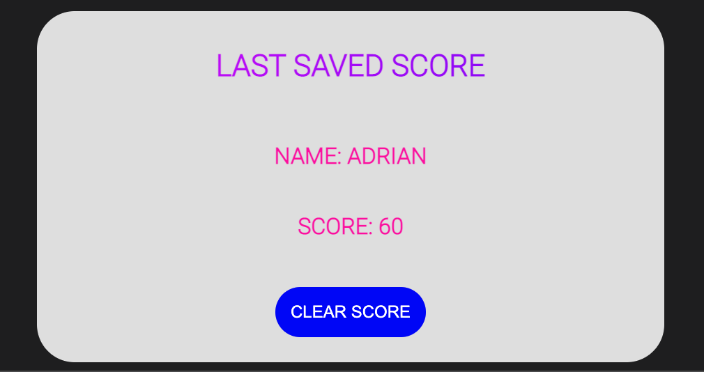

# **Adrian Strozzi - Code Quiz**

## Description

> Welcome to the Code Quiz! This a basic Javascript Quiz which has a 60 second time limit. Each correct answer scores 10 points and each wrong answer will substract 10 seconds from the timer. Once finished you can input and save your name and score.

## How to use

Use this **link** to access the Code Quiz: [Adrian Strozzi - Code Quiz](https://adrianstrozzi.github.io/Tec04CodeQuiz/)

## Usage

Below is an image of all the elements in the Code Quiz Page:

Click the **Start! Button** to start the quiz and enable the timer:  

Click on any of the **Options** to go to the next question:

If you have a **Correct Answer** the timer will stop, you will see an alert and get 10 Points:

If you have a **Wrong Answer** the timer will stop, you will see an alert, you won't get points and substract 10 seconds from the timer:

Once you **Complete the Quiz or the Timer Ends** you will see an alert:

After you see the above alert the **Input Score** will show and you will be able to enter your name and score:

Once you hit **Save** your name and score will be shown in the Last Saved Score section:

You can also click on **Clear Score** to delete the current shown name and score and delete the local storage:

## Credits

**Adrian Strozzi:** [https://github.com/adrianstrozzi](https://github.com/adrianstrozzi)

## License

**© 2022 Adrian Strozzi**
